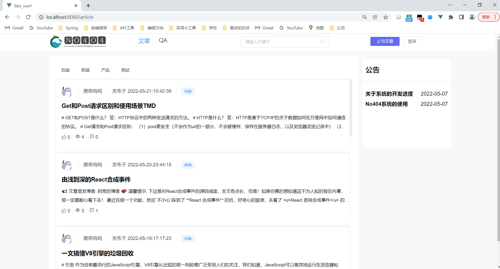
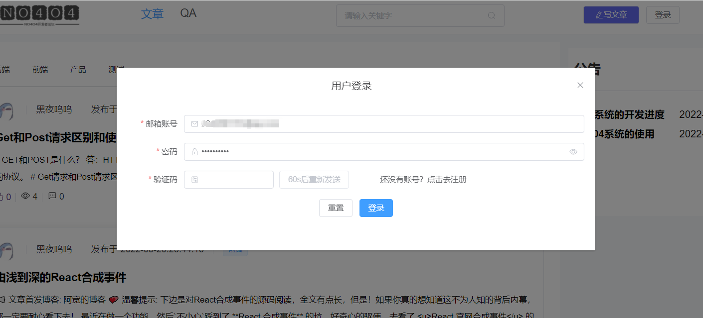
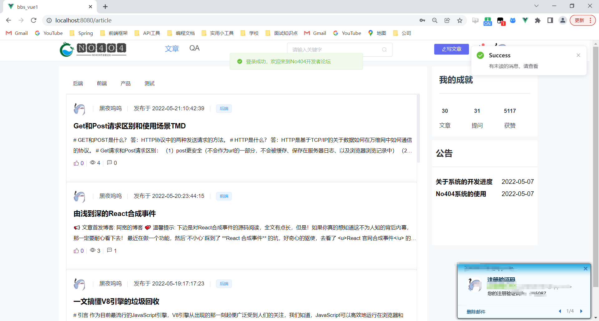
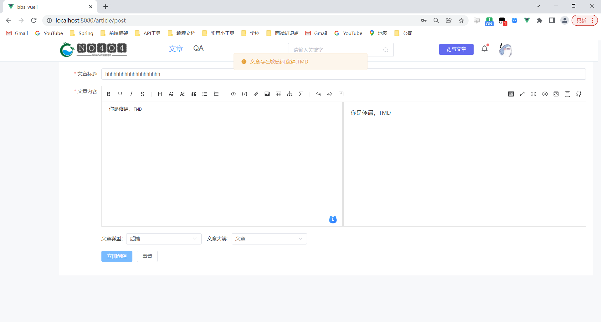
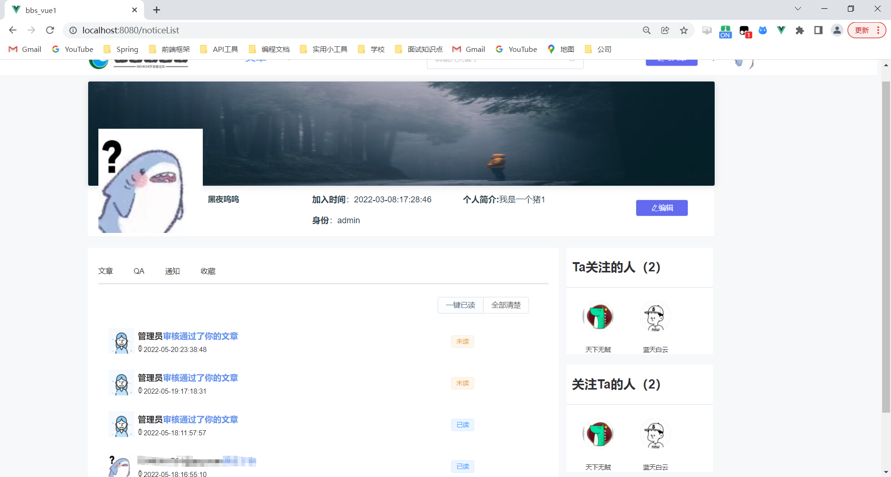
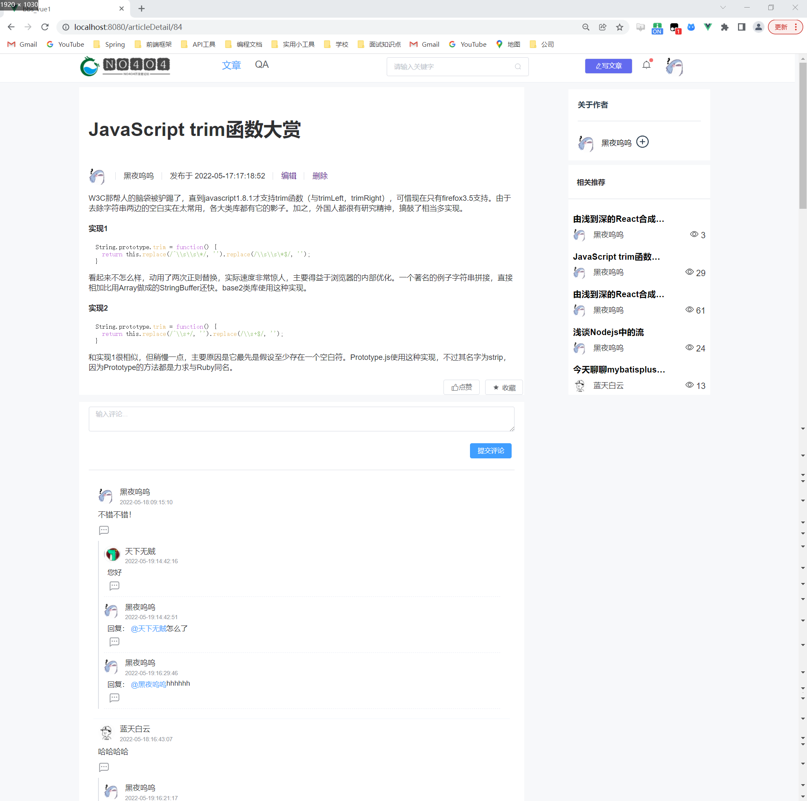
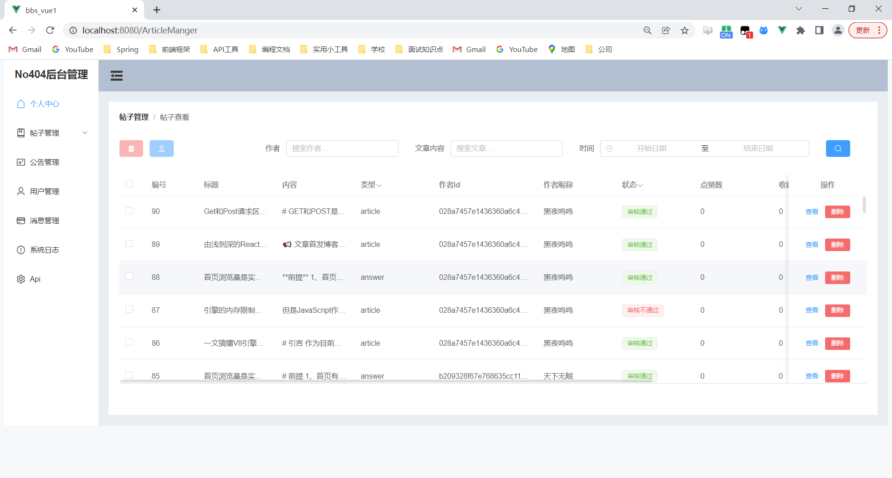

# BBS开发者论坛系统

#### 介绍
基于springboot的bbs论坛设计。
前台功能：主页文章分类浏览，个人成就，发布文章（有敏感词过滤功能），评论回复，关注作者，收藏点赞文章等等。实时通信。
后台功能：文章的审核，删除等等；文章类型的增删改查；公告的增删改查；系统日志的记录。用户的增删改查；系统API接口的查看。
后续有时间会继续维护。
#### 软件架构
前端使用vue+element-plus+router+pinia 后端使用springboot+mybatisplus+shiro+jwt+redis

#### 实现效果图展示
主页

登录

文章发布和敏感词过滤

个人主页

文章详情

后台
